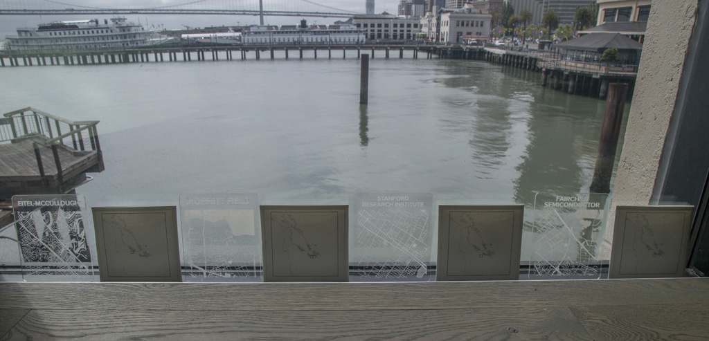
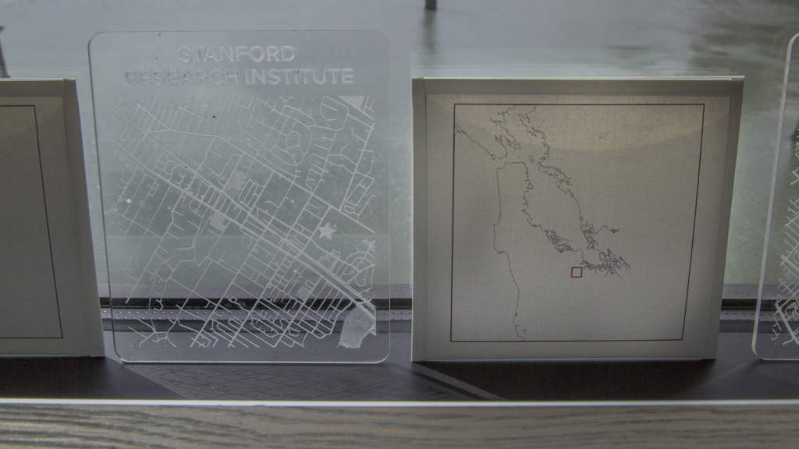

<h3>About</h3>

As we considered directions for the Situated Systems project, the Experimental Research Lab co-founders asked us to engage—with the immediate landscape, with the community of Pier 9, and with audiences in San Francisco. They asked us what we could do that was unique to their facility—how we could enact things that could only happen there. Though their use of the word &quot;engagement&quot; implied a particular type of making, leveraging the unique and immense resources of the facilities and its knowledgeable minders, we chose to view it more broadly.

Our original proposal included the idea of walkshops, a strategy by which we would lead participants in investigations of the physical environment surrounding Pier 9. However, iterative conversations about engagement increasingly caused us to consider ways in which we could intervene, supplement, and contextualize the everyday experience <em>within </em>Pier 9 for its own staff, while also adding to the fabric of the environment in a way that could be meaningful for both insiders and outsiders. We created what we describe as a speculative exhibition, a notional integration of the artifacts that we created into the workspaces of Pier 9.

The underlying approach is to consider Pier 9 as a viewshed, both literal and figurative, to various perspectives. The Pier’s geographic location situates the facility within a physical and conceptual triangulation of military, industrial, and environmental history. Standing at south-facing windows, a viewer may see the cranes of the <a href="http://www.portofoakland.com/port/seaport/">Port of Oakland</a> and, further, the fog-hazed forms of the <a href="http://alamedanavalairmuseum.org/">Alameda Naval Air Station</a>; further to the south, a viewer may be aware of ghosts of the industrial history of the waterfront, revealed in locations such as the <a href="http://www.foundsf.org/index.php?title=HILLS_BROTHERS_COFFEE">Hills Brothers Coffee Sign</a> on a building near the Bay Bridge and <a href="http://www.nrc.gov/info-finder/decommissioning/complex/hunters-point-naval-shipyard.html">Hunter’s Point Naval Shipyard</a> further down the Bay. At north-facing windows the viewer is immediately confronted by the structure of <a href="http://www.exploratorium.edu/press-office/press-releases/pier-15-facts-interest">Pier 15</a>, a site which served as the primary embarkation point for troops during WWII; a <a href="http://www.ssjeremiahobrien.org/about.php">Liberty Ship</a> is docked further north on the Embarcadero, and <a href="https://www.nps.gov/goga/learn/historyculture/fort-mason.htm">Fort Mason</a> and the <a href="https://www.nps.gov/prsf/learn/historyculture/index.htm">Presidio</a>—both a key part of centuries of Bay Area military history—are located just beyond it. Standing outside of Pier 9 on either side, a viewer who faces east towards the Bay views <a href="http://www.sparkletack.com/2007/08/05/63-san-franciscos-treasure-island-pt-1/">Treasure Island</a>—a key military location that was active throughout the 20th century, whose landscape currently lies dormant <a href="http://thebulletin.org/treasure-island-cleanup-exposes-navy%E2%80%99s-mishandling-its-nuclear-past">due to environmental toxicity</a> resulting from its previous operations. There are, of course, many relevant sites that can’t be as easily visually inferred from Pier 9, including the <a href="https://www.nps.gov/nr/travel/wwiibayarea/mar.HTM">Mare Island</a> and <a href="http://www.atlasobscura.com/places/richmond-shipyards">Richmond</a> shipyards to the north and <a href="http://www.e-flux.com/journal/light-industry-toxic-waste-and-pastoral-capitalism/">sites of environmental impact within Silicon Valley</a> to the south, to name just a few.

To intervene in the space, supplement the existing environment, and contextualize the work occurring at the Pier, we focused on four major tactics. Pier 9 is an active workplace; we first felt it important to operate in ways that could impact the everyday fabric of the environment, and sought opportunities to place project materials in workspaces rather than in designated exhibit areas. Second, in order to critically interrogate the work of Pier 9, we looked for locations to juxtapose items in relation to existing Pier environments, machines, and views, creating a dialogue around the Pier’s work within the larger Bay history, within an expanded view of purpose and perspective, and with a sense of both chronological and physical scale. Third, as a nod to the Pier as a place fundamentally engaged with the fabrication of tangible objects, we sought opportunities to converse with the physical materials of the site. And fourth, by utilizing the first three tactics, we aimed to change the viewsheds themselves—activating various aspects of the environment and literally altering the views from the Pier’s windows, so they become portals for productions of meaning.

We imagined conspicuous interventions, such as window overlays that would literally frame a person’s view, and subtleties, such as hanging experimental zine pages made of plywood on wooden walls to both juxtapose materiality and to integrate a piece so carefully into the environment that it could feasibly be missed. Our tone leaned more towards tweaking the environment than causing tumult. These interventions were fundamentally inspired by artistic and theoretical modes of seeing, such as <a href="https://www.guggenheim.org/artwork/3698">Ad Reinhart’s black paintings</a>—canvases covered in layers of paint with subtle differences <a href="http://www.brooklynrail.org/special/AD_REINHARDT/black-paintings/ad-reinhardts-black-paintings-a-matter-of-time">that can only be perceived when</a> closely observed, Joseph Kosuth’s <a href="http://www.moma.org/learn/moma_learning/joseph-kosuth-one-and-three-chairs-1965">object juxtapositions</a> (rooted in his theories of the &quot;production of meaning&quot;), and John Dewey’s <a href="https://www.amazon.com/Art-as-Experience-John-Dewey/dp/0399531971">definitions of art as experience</a>. Both <a href="https://www.amazon.com/Art-After-Philosophy-Collected-1966-1990/dp/0262111578">Kosuth</a> and Dewey wrote at length about a work of art being the result of a combination of materiality and the inferences those materials bring, the artist’s intent, and the personal background of a viewer that is brought to the art through their gaze. We took all three of these elements into account as we imagined the possibilities.

After working with Pier 9 staff to interrogate what areas, including those not typically used for exhibits, we could activate and which would need additional consideration, we ultimately chose to conceive of the exhibit as speculative rather than physical so that we could have the most imaginative flexibility. We identified locations based on materiality, line of sight, amount of daily traffic, and meaningful intersections with the stories that we wanted to tell.

<h3>Components</h3>

<em>We modified existing floor plans, annotated them with photographs, and iteratively notated them throughout conversations with Pier 9 staff.</em>

Within the speculative exhibit, we imagined that items would be placed in juxtaposition to windows and glass dividers, walls, and other types of surfaces (including rafters, bookshelves, and tables). Some examples follow.

<h4>Windows</h4>

Windows were activated to modify the literal views from the Pier. These modifications connected the Pier to places nearby (such as the Alameda Naval Air Station) or further afield (such as sites of importance to the history of Silicon Valley as a technological center).

<em>Map tiles of key historical sites; photograph by Blue Bergen.</em>

<em>A site visit box about Alameda Naval Air Station augments a view that includes Alameda in the distance; photograph by Blue Bergen.</em>

Additional interventions could include translucent overlays on windows in the Pier 9 Arcade, metal and/or wood shop, kitchen, and Studio 9 spaces. These overlays would relate to footprints indicated on the ground beneath them, specifically framing a visitor’s view with additional information about locations that could be either seen or inferred from the specific view. In the process of developing the exhibit, we investigated means by which to create these overlays as drawings to include solar-powered electronic highlights, using conductive ink and/or thread.

We also looked at glass walls that served as thresholds between spaces—between the kitchen and the hallway and between the shipping area and the workspace. Though they were intriguing, we chose not to use those areas, as we did not have existing content that would bring new perspectives for those specific spaces.

<h4>Walls</h4>

We sought walls that were not typically used to exhibit art, particularly those that Pier 9 staff might encounter on a daily basis. We looked at available spaces in conference and phone rooms, focusing on those walls that weren’t treated with whiteboard paint or otherwise already occupied with art. We also investigated walls that were parts of nooks, such as the womb-like slatted-wood ‘Moby Dick’ space.

The wall we chose for the experimental zine is surfaced with a pale wood, so the plywood ‘pages’ of the zine nearly disappear into the surface. This wall also faces both the artists-in-residence area and a seating area within it, and the mounted pages create a subtle visual focus for the space. As an alternative to a single installation point, the pages could also be dispersed throughout the wood walls of the artists-in-residence space. Exhibiting the plywood pages of the zine on light-colored wood at Pier 9 parallels our deliberate choice of that material to reflect its use at decommissioned military sites, the stories of which create context for Pier 9’s own work. In another example of resonance, we placed the Treasure Island &quot;historic plaque&quot; page over the desk of the Bay Area-native artist who originally suggested it as a research site for the project.

<em>Pages of the experimental zine placed on the wall across from the artists-in-residence area; photograph by Blue Bergen.</em>

<em>Pages of the experimental zine scattered throughout the artists-in-residence area; photograph by Blue Bergen.</em>

<h4>Surfaces</h4>

Our possibilities for the use of non-wall surfaces varied widely.

The working environment of Pier 9 provided a wide variety of shelving, equipment, and other surfaces in which to integrate artifacts.

Our icons and Mare Island machines were simply added to an existing display of objects fabricated in the Pier 9 Print Shop.

	

	

	

<em>Items integrated into object shelves in the Pier 9 print shop; photograph by Blue Bergen.</em>

Our icon of material scientist Ursula Franklin, whose work deals with the cultural systems that arise from technologies, including modes of fabrication, fits naturally within the tool shelves of the wood shop, serving as reminder of larger societal impacts within the practically-focused space.

 
<em>Ursula Franklin within the wood shop; photograph by Blue Bergen.</em>

Similarly, Donna Haraway, author of &quot;A Cyborg Manifesto&quot;, was a natural fit to oversee the electronics lab, a place defined by the interaction of humans with electronic technology.

<em>Donna Haraway within the electronics lab; photograph by Blue Bergen.</em>

We placed copies of <em>Situated Systems</em>, our zine series, in the Pier 9 library and in spaces where newspapers and magazines were read and shared, adding perspectives from our research to the existing resources.

While many of these interventions are practical, one crucial one could only happen through the speculative process: tiny, 3D-printed machines, created by scanning machining equipment that was once installed at the Mare Island Naval Base, serve as evocative juxtapositions to the large, functional machines of the Pier 9 shops.

We utilized our project stickers, based on those found on Mare Island machines, to identify the &quot;Mission Support&quot; that was most crucial to this project. This included the 3D printer used to print the Mare Island machines, an extensive set of hand tools, and the Pier 9 staff themselves.

Additional opportunities exist to disperse elements throughout the space. For instance, additional site boxes could be integrated within the collections of playful objects found throughout the facility, and the digital bibliography and annotated map could be left on tablets placed adjacent to casual seating areas. Given the relatively small scale of our tangible project outputs and the large size of the facility, we’ve documented only the smallest set of possibilities for a speculative exhibition in the Pier 9 spaces.
