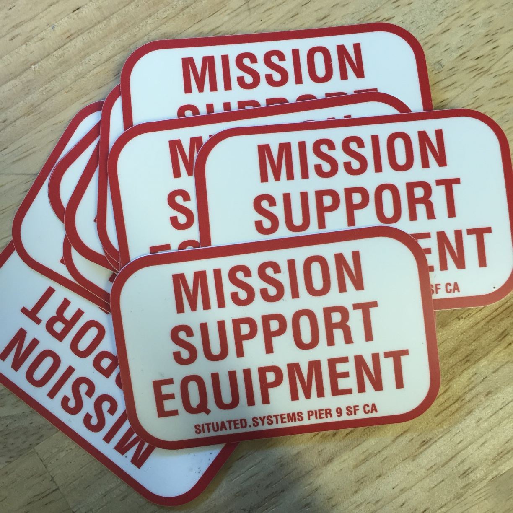

<h3>Stickers</h3>

One of the goals for this project was to materialize the hidden military history and infrastructure of the Bay Area, in order to make it something that could be engaged with directly. These stickers are modelled after those affixed to machining equipment from the Mare Island Naval Shipyard, which has now found new homes across the Bay Area.

<h3>Materials</h3>

Die-cut vinyl stickers.

<h3>Production</h3>

Files created in Adobe Illustrator. Stickers printed by <a href="https://www.stickermule.com/">Sticker Mule</a>.

<h3>T-Shirts</h3>

These shirts were created to highlight four themes that repeatedly emerged during discussions of our research process. You can buy them <a href="http://www.zazzle.com/situatedsystems">here</a>.
 

